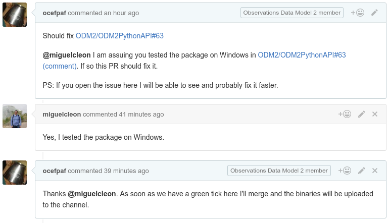

% The ODM2 Conda Channel
%
% April 29th

---

# Who am I?

- [Filipe Fernandes](https://github.com/ocefpaf)
- Involved in the [IOOS conda channel](https://github.com/ioos/conda-recipes/wiki)
- Now deeply involved in the [conda-forge](https://conda-forge.github.io/) community channel

. . .

See http://wesmckinney.com/blog/conda-forge-centos-moment/ for more on conda-forge


# What is a Conda Channel?

> - Is similar to a Linux repository (or app store)
> - The service is hosted for free at Continuum's Anaconda Cloud
> - We can upload pre-compiled binaries using the `conda` package manager

# What is a conda?

> - From their own webpage:
> - "Package Everything!"
> - "And share your repositories with clients or colleagues."

# Why use conda?

> - Version dependency solving (e.g.: geoalchemy-odm2 fork)
> - Reproducible environments are easy to create
> - One recipe for multiple platforms (no `apt-get`, `yum`, `brew`, etc)

. . .

http://technicaldiscovery.blogspot.com.br/2013/12/why-i-promote-conda.html

# The ODM2 Channel

> - 10 packages compiled for Python 2 and 3 (when possible)
> - Available platforms are Linux-64, Windows-32/64, and OS X
> - You can install with `conda install -c ODM2 odm2api`


# How to use the channel?

```bash
conda config --add channels ODM2

curl -L http://bit.ly/ODM2-env -o environment.yml

conda env create environment.yml
```

. . .

That is it!


# ODM2 environment file

```yaml
name: ODM2
channels:
    - ODM2
dependencies:
    - python=2.7
    - odm2api
    - wofpy
    - jupyter
    - matplotlib
```

# How is the channel populated?

> - The recipes are hosted on [GitHub](https://github.com/ODM2/conda-recipes-ODM2)
> - [AppVeyor](http://www.appveyor.com/) &#10139; Windows
> - [Travis-CI](https://travis-ci.org/) &#10139; OSX
> - [CircleCI+Docker](https://registry.hub.docker.com/u/ocefpaf/centos64-conda-obvious-ci/) &#10139; Linux

# Issues


# PRs



# How to contribute?

> - Report problems
> - Request packages or new releases
> - Send PRs adding/fixing packages

. . .

    https://github.com/ODM2/conda-recipes-ODM2/issues

# Submitting a recipe

> - Fork https://github.com/ODM2/conda-recipes-ODM2
> - Add the recipe directory (for more info see the conda [docs](http://conda.pydata.org/docs/building/recipe.html))
> - Submit the PR
> - The recipe will be built and, if merged, uploaded to the channel

# Creating a [recipe](https://github.com/ODM2/conda-recipes-ODM2/blob/master/odm2api/meta.yaml)
```yaml


package:
  name: example
  version: {{ version }}

source:
  fn: example-{{ version }}.tar.gz
  url: https://pypi.python.org/example-{{ version }}.tar.gz
  md5: 842b44f8c95517ed5b792081a2370da1
  patches:
    - some.patch

build:
  number: 0
  script: script: python -m pip install --no-deps .

requirements:
  build:
    - python
    - pip
  run:
    - python

test:
  imports:
    - example
  commands:
    - example --version

about:
  home: https://example.com/examples/
  license: BSD 3-Clause
  summary: An example package

extra:
  recipe-maintainers:
    - GitHubHandle

```

# The truth about creating a recipe

> - `conda skeleton pypi psycopg2`
> - [Search](http://anaconda.org/search?q=ODM2api), download, copy, and paste
> - Fetch directly from known and trusted [sources](https://github.com/ocefpaf/conda-recipes-ODM2/tree/master/shapely)

. . .

```yaml
# Placeholder meta, the canonical one comes from source.txt

package:
   name: shapely

build:
   script: exit 1
```

```text
gh-repo: conda-forge/shapely-feedstock
git-tag: master
contents: recipe/*
```

# Maintaining recipes

```yaml


package:
  name: example
  version: {{ version }}

source:
  fn: example-{{ version }}.tar.gz
  url: https://pypi.python.org/example-{{ version }}.tar.gz
  md5: 842b44f8c95517ed5b792081a2370da1
  patches:
    - some.patch

build:
  number: 0
  .
  .
  .
```
# Maintenance example


# The conda-recipes-ODM2 repository

Let's try to answer:
    - What's needed in the repo to be ready for packaging
    - The multi-OS support
    - The role of the Continuous Integration (CI)

https://github.com/ODM2/conda-recipes-ODM2

# Questions?


